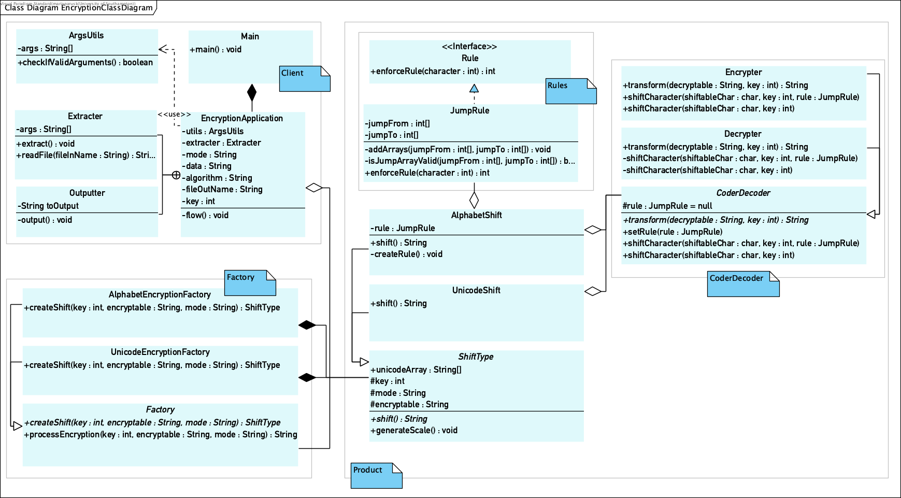

#HyperSkill Encryption project
##tl;dr
##What is it?
The project in this repository is a part of a course I took on 
[hyperskill.org](https://hi.hyperskill.org). HyperSkill is a website that 
offers free courses to learn programming languages, technologies, and Computer 
Science related concepts. Each course is divided into small sections, each 
section consisting of multiple topics of theory with relevant exercises. The 
final task in each section is to implement a part of the project based on the
 knowledge obtained from the exercises in that section.

This specific project is called Encryption-Decryption and this is the 
description from the HyperSkill site:
> **About:**\
  Privacy is an important matter is the realm of the Internet. When sending a
   message, you want to be sure that no-one but the addressee with the key 
   can read it. The entirety of the modern Web is encrypted - take https for
   example! Don’t stay behind: hop on the encryption/decryption train and 
   learn  the essential basics while implementing this simple project.\
  **Result:**
  Gradually get familiar with Java, paying special attention to working with
   files and the command line.
   
When completed, the project should be able to obtain and process command line
 arguments
(incuding the ncryption type, the key, the encryptable string) and to 
 convert the input based on it.
   
##How did I structure it?
We were told 

This is the final result, as visualised by an UML class diagram:

##What I learned?
Although most of the topics in this course were familiar to me, there were 
some areas of Java, I had picked up on the go when necessary, but never spent
 time explicitly learning them. These topics include:
 
 * Annotation;
 * Enums;
 * Factory method;
 * Revision of abstract classes and interfaces;
 * Initialisation blocks.

The most important part for me seemed to be the software engineering aspect 
of it. So far the university courseworks have kind of given us the structure 
in advance and there has been little thought. The project I did during my 
internship had a clear structure as well due to Spring Boot 2.0 having the 
models, controllers, services and serviceinterfaces. Here I was responsible 
for my own software engineering stuff. 

##Further development ideas
Reading the book 'Clean code', - some ideas now, but I would like to have a 
clear plan when revisiting the code. I feel that this would be a good way to 
practice what the book proposes. 

Software engineering principles can be applied infinitely. When looking into 
articles and StackOverFlow answers about whether or not to add interfaces and
 how general-purpose I should make the classes (e.g. instead of the current 
 structure where the factory creates either a UnicodeShift or the AlphabetShift,
  my initial idea was to have the factory create UnicodeShiftEncryption, 
  UnicodeShiftDecryption, AlphabetShiftEncrypto etc.) which would have also 
  been a viable solution if this program will not be developed any further.
  
  although I cannot promise this, I think it would be great to continue 
  developing this once I know more encryption types, so that this would be a 
  good way to practice freshly obtained knowledge. unfortunately, I have no 
  university courses on encryption, so this will go to the end of my current 
  'further developments courses to take' list.