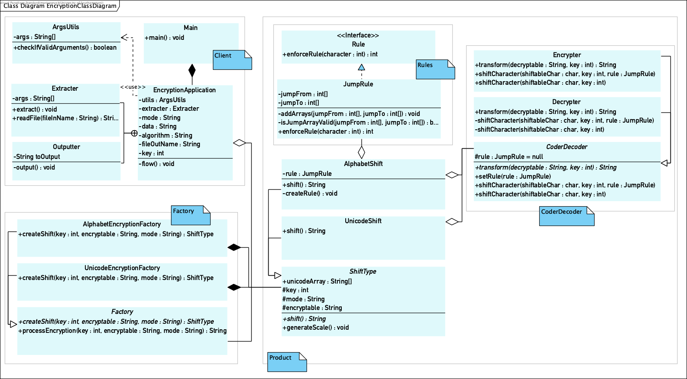

# HyperSkill Encryption project
## What is this?
The project in this repository is a part of a course I took on 
[hyperskill.org](https://hi.hyperskill.org). HyperSkill is a website that 
offers free courses to learn programming languages, technologies, and Computer 
Science related concepts. Each course is divided into small sections, each 
section consisting of multiple topics of theory with relevant exercises. The 
final task in each section is to implement a part of the project based on the
knowledge obtained from the exercises in that section.

This specific project is called Encryption-Decryption, the aim of it was to give a 
thorough overview of what Java and OOP is.
   
## How did I structure it?
This is the final result, as visualised by an UML class diagram:

I used the factory pattern to ease readability although I believe that for a small 
project like this, implementing the pattern actually took longer than it was worth as 
the factory interface has only two factories. Nevertheless, this was a valuable lesson
of why design patterns are useful as this was my first time implementing one.

## What did I learn?
Although most of the topics in this course were familiar to me, there were 
some topics in Java I had picked up on the go but had never spent
time explicitly learning them. These topics include:
 
 * Annotations;
 * Enums;
 * Design patterns such as the Factory method;
 * Initialisation blocks.

The most important part for me seemed to be the software engineering aspect 
of it. So far the university courseworks have kind of given us the structure 
in advance and there has been little thought. The project I did during my 
internship had a clear structure as well due to Spring Boot 2.0 having the 
models, controllers, services and serviceinterfaces. Here I was responsible 
for my own software engineering stuff. 
